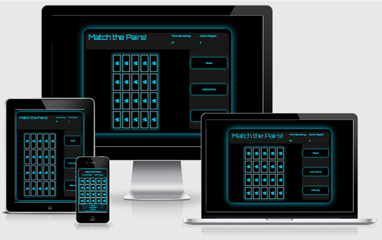

# Match the Pairs!

Welcome to Flash, . Made for my Code Institute Milestone Project 2.

Follow the link to [Match the Pairs!](https://dominicspears.github.io/milestoneproject2-memorygame/)

### Contents

1. [Introduction](#intro) 
2. [Technologies](#tech) 
3. [UX](#ux)
4. [Features](#feat)
5. [Testing](#test)
6. [Deployment](#deploy)
7. [Credits](#credit)

___

### Introduction

This site is a memory game based on a classic card game. The game begins with a grid of hidden cards and the player can 
reveal 2 cards at a time. If the image on the cards is a match, the cards will remain revealed. If the cards are mis-matched, 
they will flip back over. By remembering the location of each image, the player can match each pair. The aim of the game is 
to reveal the entire grid of cards.
___

### Technologies

Technologies used to create the site:

* HTML 
  * The project uses **HTML 5** to create the basic layout and site structure.
* CSS
  * The project uses **CSS 3** to style the html to be aesthetically pleasing and responsive.
* JavaScript
  * The project uses **JavaScript** to provide an interactive experience and functionality.. 
* [Font Awesome](https://fontawesome.com/) 
  * The project uses **Font Awesome Version 5.15.1** to add icons that aid aesthetics or provide social media links.
* [Google Fonts](https://fonts.google.com/)
  * the project uses **google fonts** as a source for its extra fonts.
* [Balsamiq](https://balsamiq.com/wireframes/?gclid=EAIaIQobChMIovzYmYzE7QIVhOvtCh0Nrwz5EAAYASAAEgKhdvD_BwE)
  * The project used **Balsamiq** to create wireframes during the planning phase.
* [Color Dropper](https://chrome.google.com/webstore/detail/color-dropper/cbagleaaaocejmdeichhdkmjebpljckh)
  * The prject uses the **color dropper** (a Chrome add on) to help select colors.
___

### UX

### Strategy Plane

#### Potential Users

Users
* Experienced with PC gaming
* New to PC gaming / casual

### Scope Plane

#### Features specific for users

Experienced with PC Gaming

* In depth instructions to explain game mechanics.
* Gameplay that is easy to learn but difficult to master.
* Replay value via a scoring system...
* Or a rating based on the last performance.
* A score breakdown so they can understand how to get a higher score.

New to PC gaming / casual
* Basic / fundamental instructions. 
* Visually striking and memorable
* An ending screen/modal to congratulate the player upon completion.

### Structure Plane

#### User stories

Experienced with PC gaming:

1. As an experienced gamer, I want to understand the game thoroughly by reading a comprehensive set of instructions.
2. As an experienced gamer, I want to know my final score/performance level and how my score / performance could be improved.
3. As an experienced gamer, I want an experience which is difficult to master.
4. As an experienced gamer, I want the game to be easy to view over extended playthroughs, without causing eye strain.

New to PC gaming / casual: 

1. As a new gamer, I want instructions that are simple to follow and a game concept that I can understand easily.
2. As a new gamer, I want a congratulations screen when completing the game to provide a sense of accomplishment.
3. As a new gamer, I want the game to be visually appealing and memorable. 

### Skeleton Plane

#### Wireframes

[Main Page Wireframe](assets/wireframes/MP2-mainpage-med.png)

[Modal Wireframes](assets/wireframes/MP2-modals-med.png)

### Surface Plane
* Dark background to minimize eye strain, means that game and fonts must be lighter.
* Distinctive theme color (light blue), stands out from the background without being intrusive.
* Title typography that is futuristic to match the clean design and bulk typography that is simple and easy to read.

___

### Features

#### Start Modal
##### Active
* Click the start button to begin the game and start the timer.
* Click outside of the modal content box to produce the same result. 

#### Main Page
##### Active
* Countdown clock, begins counting down when the game begins and counts down in second incraments to zero at which the game ends.
* Flip counter, increases by 1 each time the player clicks.  

#### Game Grid
##### Active
* Each click flips a card, revealing the image on the reverse side.
* Each card can only be flipped once and will only add 1 to the flip counter.
* If the cards do not match, the cards will linger upright to provide time to memorise the image. The cards will then 
flip back to their original position.
* If the cards match, the cards will remain upright. They cannot be selected again.
* Only two cards can be selected at one time.
* During the flip back, all remaining cards lock and cannot be selected until the flip animation finishes. 
* Successful completion of the game reveals the victory modal.
* Unsuccessful completion (timer runs out) reveals game over modal.

#### Navigation Buttons
##### Active
* Reset button, resets the page to its original settings. 
* Instructions button, reveals a modal with game instructions. 
* About button,  reveals health benefits of memory games.
##### To Do  
* Reset button, reset the game without resetting the whole page and therefore other features e.g. the music.
* Settings button, shows a new modal to provide user options e.g. music volume.

#### Instructions Modal
##### Active
* Srollbar on the side of the page.
* Restart game button resets the page to the starting screen, beginning the countdown again.  

#### About Modal
##### Active
* Srollbar on the side of the page.
* Restart game button resets the page to the starting screen, beginning the countdown again.  

#### Victory Modal
##### Active
* New game button closes the modal and restarts the countdown timer.
* Clicking outside the modal produces the same result.
* Score produced by taking total flips from a set number(100). Fewer flips means higher final score.

#### Game Over Modal
##### Active
* New game button closes the modal and restarts the countdown timer.
* Clicking outside the modal produces the same result.

### Testing

For all testing, please follow the link to a dedicated page. [Testing Page](testing.md) 
___

### Deployment

#### To deploy to gihub pages:

1. Login to github
2. Select DominicSpears/milestoneproject2-memorygame
3. Select the settings tab
4. Scroll down to gihub pages section
5. Under source, select Master branch
6. The website is now deployed
7. Scroll back to github pages section to find deployed website link

#### To run this project locally:
You will need a github account and to use the chrome browser

1. Install the Github browser extensions for chrome, restart after installation
2. Login to gihub
3. Navigate to the project repository
4. Click on the "Gitpod" button, located in the top right of the page menu
5. This creates a new workspace for local workspace

#### To clone this project (work within a local IDE)

1. Go to the project github repository
2. On the project page, click on the "code" dropdown menu icon
3. Copy the clone url by clicking the clipboard icon on the right side
4. Open a new terminal of your local IDE
5. Type git clone then paste the copied url
6. Press enter, the local clone is created
___

### Credits

#### Code
* Set timeout for function that delays access to game grid at start of game. [w3schools](https://www.w3schools.com/jsref/met_win_settimeout.asp) 

* Centralise game grid div. [css-tricks](https://css-tricks.com/centering-css-complete-guide/) 

* Align text of the victory modal centrally. [w3schools](https://www.w3schools.com/cssref/pr_text_text-align.ASP) 

* Create a box shaddow around all sides of a div. [stackoverflow](https://stackoverflow.com/questions/5608222/how-to-apply-box-shadow-on-all-four-sides) 

* Create a box shaddow around all sides of a div. [css-tricks](https://css-tricks.com/forums/topic/how-to-add-shadows-on-all-4-sides-of-a-block-with-css/) 

* Create a css modal with javascript functinality. [w3schools](https://www.w3schools.com/howto/howto_css_modals.asp) 

* Changing the display property of a specific div. [mozilla](https://developer.mozilla.org/en-US/docs/Web/API/Element/classList) 

* Call a function for each card in the array, hide cards. [w3schools](https://www.w3schools.com/jsref/jsref_foreach.asp) 

* Using the arrow shorthand for function. [w3schools](https://www.w3schools.com/js/js_arrow_function.asp) 

* Reminder of how to use media rules [w3schools](https://www.w3schools.com/cssref/css3_pr_mediaquery.asp) 

* Setting text transform to uppercase for the start modal. [w3schools](https://www.w3schools.com/cssref/pr_text_text-transform.asp) 

* Customising a scrollbar to fit my aesthetics. [w3schools](https://www.w3schools.com/howto/howto_css_custom_scrollbar.asp) 

* Setting a function with multiple perameters. [w3schools](https://www.w3schools.com/js/js_functions.asp) 

* Shuffle cards using fisher-yates shuffle. [bost](https://bost.ocks.org/mike/shuffle/) 

#### Media
##### Images
* All images  were located via bing images, searched under "free to share and use" licences.

##### Music
* Background music, taken from ZapSplat website via their standard license [ZapSplat](https://www.zapsplat.com/music/game-music-action-fun-and-funky-electronic-disco-with-wah-guitars-electro-bass-and-drums/)

#### Acknowledgements

* Inspired by [W3Schools.com](https://www.w3schools.com/html/html_intro.asp)
General reference / tutorial assistance.

* Inspired by [FreeCodeCamp](https://www.youtube.com/watch?v=ZniVgo8U7ek)
General reference.

* Inspired by [Code with A K](https://www.youtube.com/watch?v=tjyDOHzKN0w)
General reference.

* Inspired by [PortEXE](https://www.youtube.com/watch?v=3uuQ3g92oPQ)
General reference.

* Inspired by [Coding Hack](https://www.youtube.com/watch?v=4BOSWPnC9Uk)
General reference.

* Inspired by [Google Play Store](https://play.google.com/store/search?q=memory%20match%20games)
General reference, inspiration.
___