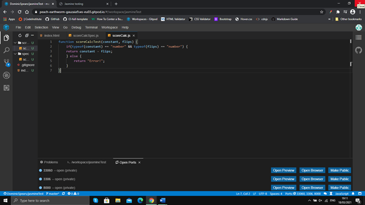

### Bugs Discovered

#### Solved Bugs

1. Time remaining
  * The time remaining would temporarily show the incorrect figure before starting the countdown. 
  * To solve this I altered the initial value in the html code to the start timer value.

2. Card matching
  * matching cards would not register the match and so flip back 
  * To solve this I added an image to the front-face div and used the image src to match the cards.
  * Code from [youtube](https://www.youtube.com/watch?v=3uuQ3g92oPQ)

3. Image visability
  * The newly added images would appear on the game grid, affecting the spacing. 
  * To solve this I added a class to each image and set the display to none.

4. Navigation buttons
  * The buttons would align at the top of the navigation div instead of spacing evenly.  
  * To solve this I gave each button its own div and each div a percentage of the navbar height
  * Code from [mozilla](https://developer.mozilla.org/en-US/docs/Web/CSS/height)

5. Instruction modal
  * The content would only start in the center and require extra scrolling to see all the information.
  * To solve this I increased the height of the i-modal-content.

6. Instructions modal background
  * If taking too long, the game over modal would appear while reading the instructions. 
  * To solve this I increased the z-value of the i-modal to 2. 
  * Code from [w3schools](https://www.w3schools.com/cssref/pr_pos_z-index.asp)

7. Early game over
  * When closing the instructions the game over modal would be visible, if taking a long time. 
  * To solve this I altered the function of the return button, making it restart the page rather than close the modal.
  * Code from [stackoverflow](https://stackoverflow.com/questions/3715047/how-to-reload-a-page-using-javascript)

8. Score
  * The score required the final flip count as a variable but was accepting the initial flip count(0). 
  * To solve this I moved the score function inside the victory function.
  * Assisted with mentor guidence.

9. Centralise memory game
  * The game would appear in the corner of the screen rather than centrally. 
  * To solve this I made the body position: relative and memory game div position:absolute, top: 50%, left: 50% and transform: translate(-50%, -50%).
  * Code from [css-tricks](https://css-tricks.com/centering-css-complete-guide/)

10. Game complete
  * All cards would flip but the victory modal would not appear. 
  * To solve this I added an if statement that if the nuber of matched cards equaled the length of the card array, the voctory function would run.
  * Code from [youtube](https://www.youtube.com/watch?v=3uuQ3g92oPQ)

11. Card flip back
  * Mis matched cards would linger for too long before flipping back. 
  * To solve this I lowered the set timout to 700ms.

12. Countdown timer
  * The timer would continue to countdown after the game was completed. 
  * To solve this I added a clear interval to the victory and game over functions.
  * Code from [w3schools](https://www.w3schools.com/jsref/met_win_clearinterval.asp)

13. Game duration
  * The game would eng too soon with the additional cards I had entered. 
  * To solve this I increased the numerical perameter in the new matched game function. 

#### Remaining Bugs

1. Audio restart
  * The background music restarts when the (instruction modal) return button is clicked. It would be better for the music to continue over multiple games. 

### Manual Testing

1. Start Game
  *Click start game on screen
  * Closes start modal and begins countdown timer
  * Result: pass

2. Start game modal
  * Click outside of modal  
  * Closes modal and begins countdown timer 
  * Result: pass

3. Countdown Timer
  * Player starts the game
  * Counts down in incraments of 1 second
  * Result: pass

4. Flip counter
  * Player clicks a card 
  * Adds 1 to the flip counter 
  * Result: pass

5. Flipped card cannot be counted again
  * Click on already flipped card 
  * Nothing added to flip counter 
  * Result: pass

6. Card flip
  * Click on facedown card 
  * Card flips 180 degrees, 3d animation
  * Result: pass

7. Card match
  * Click two identical cards 
  * Both cards remain face up 
  * Result: pass
  
8. Card match lock
  * Click two identical cards after matching
  * Clicking each card will not add to the flip total
  * Result: pass

9. Card mis match linger
  * Click two cards with different faces  
  * Both cards will linger for a short time before the flip back 
  * Result: pass

10. Card mis match
  * Click two cards with different faces 
  * Both cards will flip back (after lingering)
  * Result: pass

11. game grid lock
  * Click two cards with different faces  
  * No more cards can be clicked until flip animation is complete
  * Result: pass

12. Win the game
  * Match all pairs on the grid before timer runs out
  * Victory modal reveals
  * Result: pass

13. Victory modal, new game button
  * Click new game
  * Cards reshuffle and timer begins again and 
  * Result: pass

14. Victory modal, outside of modal
  * Click outside of victory modal
  * Cards reshuffle and timer begins again and 
  * Result: pass

15. Victory modal, score
  * Click (flip) cards and win the game
  * Score created based on number of clicks (flips)
  * Result: pass

16. Lose the game
  * Timer runs out before grid completion
  * Game over modal reveals
  * Result: pass

17. Game over modal, new game button
  * Click new game
  * Cards reshuffle and timer begins again and 
  * Result: pass

18. Game over modal, outside of modal
  * Click outside of game over modal
  * Cards reshuffle and timer begins again and 
  * Result: pass

19. Reset button
  * Click reset button
  * Restart the page/game
  * Result: pass

20. Instructions button
  * Click instructions button
  * Reveal instructions modal
  * Result: pass

21. Instrutions scrollbar
  * Click and drag scrollbar
  * Move the page and reveal more information
  * Result: pass

22. Instrutions return button
  * Click return
  * Resets the game from the start modal
  * Result: pass

### Jasmine Test
  * Javascript Spec File
  * 

  * Javascript Script File
  * 

  * Jasmine Results
  * 

### Validator Tests

#### index.html
  * W3C HTML Validator - Document checking completed. No errors or warnings to show.
  * Chrome Lighthouse - 100, 100, 100, 89.
  * 

#### style.css
  * W3C CSS Validator - Congratulations! No error found.

#### index2.js
  * JSHint Code Tester - One unused variable(ticker)  
### User Story Tests

#### Experienced with console gaming:
Experienced with PC Gaming
1. As an experianced gamer, I want in-depth instructions to explain game mechanics.
  * To address this I added extra sections to the instruction modal with difficulty and reset explained.
  * 

2. As an experianced gamer, I want replay value via a scoring system...
  * To address this I added a scoring system on the final victory modal.
  * 

3. As an experianced gamer, I want a score breakdown so they can understand how to get a higher score.
  * To address this I added details of the scoring system on the final victory modal. 
  * 

4. As an experianced gamer, I want gameplay that is easy to learn but difficult to master.
  * To address this I added similar pictures on the card faces to make matching more difficult.
  * 

New to PC gaming / casual
1. As a new gamer, I want Basic / fundamental instructions. 
  * To address this I added basic gameplay instructions that are easily understood.
  * 

2. As a new gamer, I want an ending screen/modal to congratulate the player upon completion.
  * To address this I added a victory modal with a focus on congratulating the player.
  * 

3. As a new gamer, I want the site to be visually striking and memorable
  * To address this I added a bold color scheme and clean, modern aesthetics.
  * 

