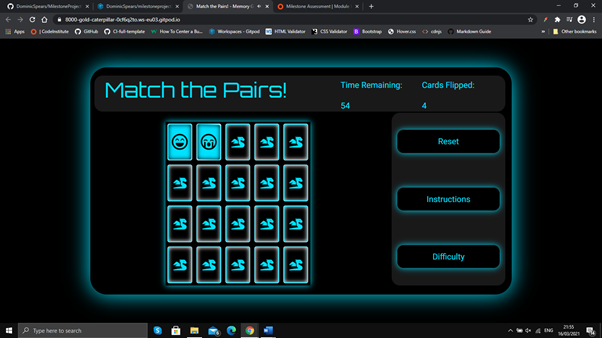

### Bugs Discovered

#### Solved Bugs

1. Navbar link alignment
  * The navbar links would automatically align on the left of the screen next to the logo. 
  * To solve this I applied justify-content: flex-end, allowing the links to hug the right side of the screen
  * Code from [W3Schools.com](https://www.w3schools.com/cssref/css3_pr_justify-content.asp)

#### Remaining Bugs

1. Video link Layout
  * The youtube videos leave a large space underneith before the footer. This is particularly evident on larger screens. 

### Manual Testing

1. Start Game
  *Click start game on screen
  * Closes start modal and begins countdown timer
  * Result: pass

2. Start gmae modal
  * Click outside of modal  
  * Closes modal and begins countdown timer 
  * Result: pass

3. Countdown Timer
  * Player starts the game
  * Counts down in incraments of 1 second
  * Result: pass

4. Flip counter
  * Player clicks a card 
  * Adds 1 to the flip counter 
  * Result: pass

5. Flipped card cannot be counted again
  * Click on already flipped card 
  * Nothing added to flip counter 
  * Result: pass

6. Card flip
  * Click on facedown card 
  * Card flips 180 degrees, 3d animation
  * Result: pass

7. Card match
  * Click two identical cards 
  * Both cards remain face up 
  * Result: pass
  
8. Card match lock
  * Click two identical cards after matching
  * Clicking each card will not add to the flip total
  * Result: pass

9. Card mis match linger
  * Click two cards with different faces  
  * Both cards will linger for a short time before the flip back 
  * Result: pass

10. Card mis match
  * Click two cards with different faces 
  * Both cards will flip back (after lingering)
  * Result: pass

11. game grid lock
  * Click two cards with different faces  
  * No more cards can be clicked until flip animation is complete
  * Result: pass

12. Win the game
  * Match all pairs on the grid before timer runs out
  * Victory modal reveals
  * Result: pass

13. Victory modal, new game button
  * Click new game
  * Cards reshuffle and timer begins again and 
  * Result: pass

14. Victory modal, outside of modal
  * Click outside of victory modal
  * Cards reshuffle and timer begins again and 
  * Result: pass

15. Victory modal, score
  * Click (flip) cards and win the game
  * Score created based on number of clicks (flips)
  * Result: pass

16. Lose the game
  * Timer runs out before grid completion
  * Game over modal reveals
  * Result: pass

17. Game over modal, new game button
  * Click new game
  * Cards reshuffle and timer begins again and 
  * Result: pass

18. Game over modal, outside of modal
  * Click outside of game over modal
  * Cards reshuffle and timer begins again and 
  * Result: pass

19. Reset button
  * Click reset button
  * Restart the page/game
  * Result: pass

20. Instructions button
  * Click instructions button
  * Reveal instructions modal
  * Result: pass

21. Instrutions scrollbar
  * Click and drag scrollbar
  * Move the page and reveal more information
  * Result: pass

22. Instrutions return button
  * Click return
  * Resets the game from the start modal
  * Result: pass

23. Difficulty button
  * Click difficulty button
  * Reveal difficulty modal
  * Result: pass

24. Difficulty modal
  * Click outside of modal
  * Closes the modal
  * Result: pass

### Validator Tests

#### index.html
  * W3C HTML Validator - Document checking completed. No errors or warnings to show.
  * Chrome Lighthouse - 100, 100, 100, 89.
  * 

#### style.css
  * W3C CSS Validator - Congratulations! No error found.

#### index2.js
  * JSHint Code Tester - One unused variable(ticker)  
### User Story Tests

#### Experienced with console gaming:
Experienced with PC Gaming
1. As an experianced gamer, I want in-depth instructions to explain game mechanics.
  * To address this I added extra sections to the instruction modal with difficulty and reset explained.
  * 

2. As an experianced gamer, I want gameplay that is easy to learn but difficult to master.
  * To address this I added similar pictures on the card faces to make matching more difficult.
  * 

3. As an experianced gamer, I want increases difficult levels to test progression.
  * To address this I wanted to add multiple difficulties to test experianced players.
  * 

4. As an experianced gamer, I want replay value via a scoring system...
  * To address this I added a scoring system on the final victory modal.
  * 

5. As an experianced gamer, I want a score breakdown so they can understand how to get a higher score.
  * To address this I added details of the scoring system on the final victory modal. 
  * 

New to PC gaming / casual
1. As a new gamer, I want Basic / fundamental instructions. 
  * To address this I added basic gameplay instructions that are easily understood.
  * 

2. As a new gamer, I want the site to be visually striking and memorable
  * To address this I added a bold color scheme and clean, modern aesthetics.
  * 

3. As a new gamer, I want an easy level to help get players started.
  * To address this I wanted to add varying difficulty levels including an easy level for beginners. 
  * 

4. As a new gamer, I want an ending screen/modal to congratulate the player upon completion.
  * To address this I added a victory modal with a focus on congratulating the player.
  * 